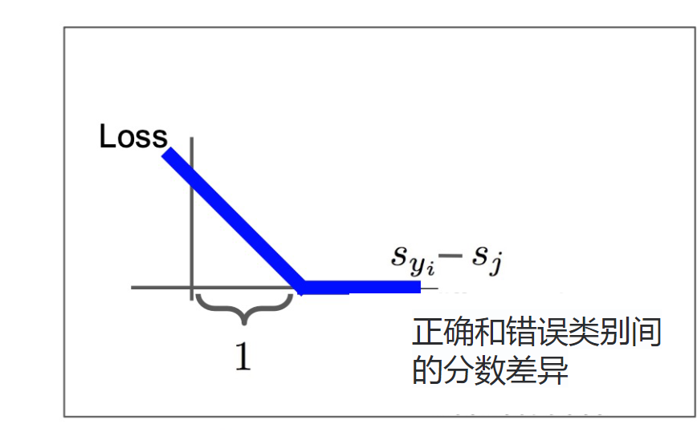
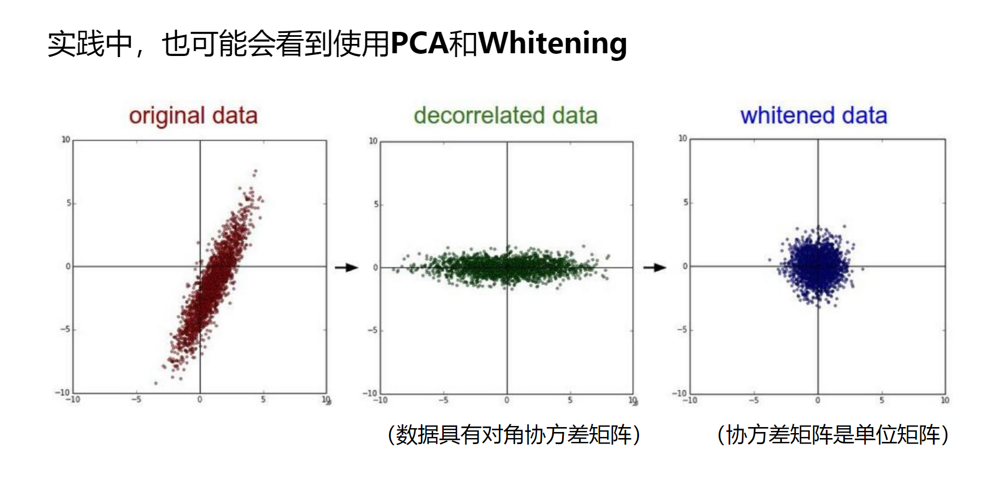
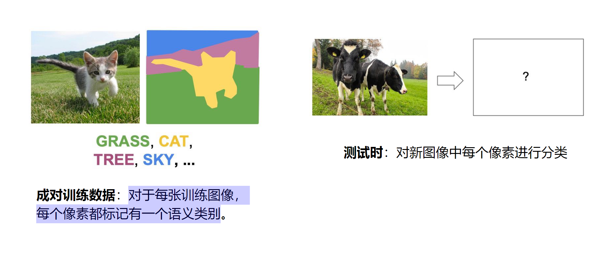
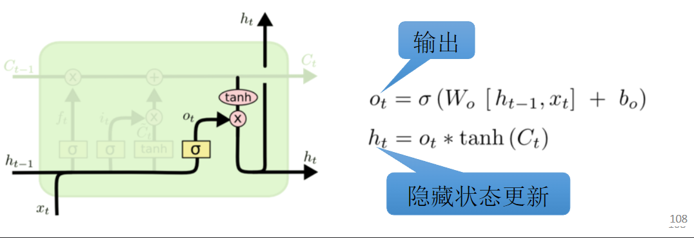

# 第一章
## 介绍
1. 图像分类：计算机视觉中的核心任务。给定一组可能的标签$(A,B,C,...)$，判断一个图片属于什么标签。
2. 图像分类可能遇到的问题：
    1. 语义鸿沟：计算机只能看到二进制数字
    2. 视角变化：每个不同角度拍摄的结果，tensor内容不同。
    3. 光照变化、背景干扰、遮挡（Occlusion）、类内变化（Intraclassvariation）、上下文（Context）
3. 数据驱动方法：
    1. 收集图像和标签的数据集
    2. 使用机器学习算法来训练分类器
    3. 在新图像上评估分类器
## 最近邻分类器
`train(image,labels) - return model`用于记住所有的数据和标签；`predict(model, test_images) - return test_labels`预测最相似的训练图像标签。
1. 最近邻方法：计算测试图像与所有训练图像的*距离*，取距离最近的训练图像的标签作为测试标签。
    1. L1距离：逐个像素计算差值绝对值。$$d_1(I_1,I_2) = \sum^p(|I_1^p - I_2^p|)$$。
    2. L2距离：逐个像素计算欧式距离。$$d_2(I_1,I_2) = \sqrt{\sum^p{(|I_1^p - I_2^p|)^2}}$$
    3. 对于最近邻方法，训练train存储训练集$X_t,y_t$；测试时计算全部输入测试$X$与训练$X_t$的绝对值差，并求最大。*训练O(1)，测试O(N)，测试速度太慢*。
2. K近邻：不从最近的邻居那里复制标签，而是从K个最近的点中获得多数投票。不适用像素距离。
3. *超参数*：k的最佳值是多少？最佳使用距离是多少？超参数设置非常依赖于问题/数据集。
    1. 如何设置超参数？**设置验证集(Validation)**，将训练集train data分成train + val集，在val上调整超参数，在test集上进行评估(evaluate)。
    2. Cross Validation：k折交叉验证。将训练集分为k份，进行k次训练，依次选取第1,2,3...k个子集作为validation，其余作为train
## 线性分类器
使用一个函数$f(W,x) = Wx + b$来进行分类。$W$是权重，输出$m$类样本概率。
1. 对于一个被拉伸到长度为$(x,1)$的图像，类别有$m$个，$W$的维度是$(m,x)$，$b$的维度是$m$，计算$f(W,x) = Wx + b$得到该图像对于$m$个类别的得分。

2. *不能解决非线性情况*：
3. **损失函数**：衡量模型结果的满意程度。$$L = \frac{1}{N}\sum_i{(L_i(f(x_i,W),y_i))}$$
    1. 多分类SVM损失：$$L_i = \sum_{j \neq y_i}(max(0, s_j - s_{y_i} + 1))$$。对于每一张图的所有$m-1$个错误类别，用正确类别分数-错误类别分数，得到的值+1，若>0则加入损失，否则不加入。本质上是要让正确类别输出分数最大。注意最终要求平均。
    
    > Q1：在这个训练例子中，如果汽车分数下降0.5，损失会发生什么？A1:*不变*
    > Q2：支持向量机损失Li的最小/最大可能值是多少？A2：*最小值0，最大值无限大*
    > Q3：初始化时W很小，所以所有s≈0。假设N个例子和C个类，损失Li是多少？A3：*$N\times(C-1)$*
    > Q4：如果求所有类别的和呢？（包括j=y_i）。A4：*相当于增加一个常数项1，$L_i' = L_i + 1$*
    > Q5：如果用均值而不是和呢：A5：更不易梯度爆炸。
    > Q6：如果我们使用$$_i = \sum_{j \neq y_i}(max(0, s_j - s_{y_i} + 1)^2)$?A6：损失函数从：变为：
    > Q7：假设能找到一个$W$满足了$L = 0$，这个$W$是唯一的吗？A7：*不是唯一的，因为至少2W,3W...也满足*
4. Softmax分类器:将原始分类器分数解释为概率。$$P(Y = k|X = x_i) = \frac{e^{s_k}}{\sum_j{e^{s_j}}}$$其中$s_j$表示第$j$类得分。
    1. *最大似然估计*：选择权重以*最大化观测数据的可能性*
    2. 单个样本损失$$L_i = -\log{P(Y = y_i|X = x_i)} = -\log{\frac{e^{s_k}}{\sum_j{e^{s_j}}}}$$
    3. 增加KL散度：$$D_{KL} = \sum_i{p_i\log{\frac{p_i}{q_i}}}$$ $P,Q$指模型预测概率、实际真实概率1。对于交叉熵损失$H(P,Q) = -\sum_i{p_i\log{q_i}}$，就是$$H(p,q) = H(p) + D_{KL}(p||q)$$，其中$H(P) = -\sum_i{p_i\log{p_i}}$是指熵
    > Q1：最小/最大可能的softmax损失Li是多少？A1：*最大为0，最小为负无穷*
    > Q2：在初始化时，所有sj将近似相等；假设C类，softmax损失Li是多少？A2：*$\log(C)$*
## 第一章重点
计算SVM和Softmax损失：SVM:$$L_i = \sum_{j \neq y_i}(max(0, s_j - s_{y_i} + 1))$$ Softmax：$$L_i = -\log{P(Y = y_i|X = x_i)} = -\log{\frac{e^{s_k}}{\sum_j{e^{s_j}}}}$$
# 第二章 
## 正则化
防止模型在训练数据上做得太好，偏好更简单的模型、对权重增加偏好、增加曲率来改善优化过程。
$$L(W) = \frac{1}{N}\sum_i{(L_i(f(x_i,W),y_i))} + \lambda R(W)$$。增加一个权重损失项(奥卡姆剃刀)。增加一个超参数$\lambda$
1. L1,L2正则化的权重损失：
    1. L1是权重绝对值和；L2是权重平方和(偏好分散的权重)；L1L2联合是增加$\beta$参数
    2. 
2. 其他正则化方法：Dropout、BatchNorm、Stochastic Depth(随机深度网络)
## 优化
### 梯度：
1. 梯度是沿着每个维度的偏导数组成的向量。*下降最陡的方向是负梯度*。
2. 梯度计算：
    1. 数值梯度：需要遍历所有维度（所有权重），是*近似计算*。对一个权重+0.001，再计算Loss，得到的新值来计算梯度：$\frac{df(x)}{d(x)} = \frac{f(x+\Delta) - f(x)}{\Delta}$
    2. 解析梯度：将Loss看成w的函数，使用微积分计算解析梯度。
3. 梯度检查（gradient check）：计算出解析梯度后，*使用数值梯度进行验证*。
4. 梯度下降：$w' = w - \text{step-size} \times \text{gradient}$
    1. 随机梯度下降：使用小批量样本（32、64个等）来近似全局Loss，对于每一批次样本都进行梯度下降。
    2. 如果损失在一个方向上变化很快，在另一个方向变化很慢怎么办？梯度下降会变成什么样？*A:沿浅维度进展非常缓慢，沿陡峭方向抖动*
    3. **损失函数具有较高的条件数**：Hessian矩阵的最大奇异值与最小奇异值之比较大
##### SGD问题：
1. *鞍点*：一个不是局部极值点的驻点称为鞍点。遇到鞍点时，梯度为0，梯度下降被卡住
2. *SGD的梯度来自于mini_batch*，可能存在噪声
3. 解决方法：
    1. 增加动量momentum：$v_{t+1} = \rho v_t + \Delta f(x)$，进行梯度下降：$w_{t+1} = w_t - \alpha v_{t+1}$。$v$指速度，$\rho$指摩擦。
    2. 使用AdaGrad：采用自适应学习率。基于历史梯度平方和来缩放学习率。
    > Q1:梯度怎么走？A1:沿着“陡峭”方向的进展受到抑制；沿着“平坦”方向的进展加快
    > Q2:随着时间累计，步长会怎样变化？A2:衰退为0
    3. 使用RMSProp，增加decay rate
    3. 使用AdaMomentum。
    > Q1:第一个时间步发生什么？A：*第一个时间步 没有历史信息可用，所以这时候的动量和平方项都比较“偏小”。这种偏小的估计在前几步会严重低估真实的一阶和二阶矩*
    4. 对AdaMomentum的第一和第二矩估计从零开始的事实进行偏差校正
    5. AdamW：有权重衰减的Adam变体
##### 学习率计划
1. 学习率衰减：在第30、60、90等轮次时降低一次学习率，或按照某个函数下降

2. 线性Warmup
    1. 在前k次迭代中，学习率从0缓慢增加到n；
    2. 经验而言，若batchsize增大N，学习率也增大N
##### 其他问题
1. Q1：为什么牛顿法（二阶Hessian矩阵逼近梯度）不适用于深度学习？
A1:Hessian有$O(N^2)$个元素,求逆需要$O(N^3)$，N = 数千万或数亿，过大
2. 实际应用中多默认用Adam
## 神经网络和反向传播
全连接网络：$f = W_2(max(0,w_1x))$，其中的$max(0,f)$是激活函数。
层数越多，非线性分类能力越强；不要使用神经网络的大小作为正则化因子，要选用更强的正则化。
### 激活函数
若不加激活函数，则多次全连接结果仍然是一个线性分类器。
1. 激活函数类型：
2. Sigmoid：缩放到0-1；存在问题：   
    1. 梯度消失，饱和的神经元会导致梯度接近0，导致权重不再训练。
    2. 不是中心对称
    3. 梯度局部都是正数，所有wi的梯度与上游梯度的符号相同，总是全部为0或全部为1.
    4. 计算exp成本较高
3. tanh：缩放-1 到 1，以0为中心，饱和神经元仍然会导致梯度消失
4. Relu：
    1. 不饱和，计算效率高，收敛速度快。
    2. 输出不是0中心。输入<0时，梯度变为0，存在“死神经元”问题
5. LeakyRelu：不存在死神经元
6. ELU：继承relu所有特性，且平均输出接近0，有负饱和状态，对噪声更鲁棒。
    1. SELU:在ELU的正负两端都加一个缩放因子$\lambda$，可以做到自规范性，适用于更深的网络，可以不用BatchNorm
7. 
8. 
### 反向传播
需要确定神经网络的损失函数，例如SVM损失/Softmax的交叉熵损失。之后通过梯度链式法则进行计算：从头开始推导，对于非常复杂的模型不可行！
##### 更好的想法: 计算图+反向传播

1. 不同门的图梯度传播：
2. 向量函数导数：
    1. 
    2. 向量导数反向传播：标量Loss对向量*z*求导，就是Loss对*z*每个标量值z1,z2...单独求导，得到一个导数向量；向量*z*对向量*x*求导，就是*z*的每个值z1,z2,...看做*x*的函数，得到雅可比矩阵$ \begin{pmatrix} f_1(x) \\f_2(x) \\f_3(x) \\ ... \end{pmatrix}$。对这个雅可比矩阵的每一项，求出对于*x*每个项x1,x2,...的导数$$ \begin{pmatrix} \frac{\partial f_1(x_1)}{\partial x_1} & \frac{\partial f_1(x_2)}{\partial x_2} & \frac{\partial f_1(x_3)}{\partial x_3} ...\\ \frac{\partial f_2(x_1)}{\partial x_1} & \frac{\partial f_2(x_2)}{\partial x_2} & \frac{\partial f_2(x_3)}{\partial x_3} ... \\ \frac{\partial f_3(x_1)}{\partial x_1} & \frac{\partial f_3(x_2)}{\partial x_2} & \frac{\partial f_3(x_3)}{\partial x_3} ... \\ ... \end{pmatrix} $$
    
    
    
    3. 矩阵对矩阵求导：
    由这些公式可以看到，对于神经网络中的一层，有：$$y = w^T x$$，若已知损失函数$L$对$y$的偏导数$\frac{\partial L}{\partial y}$，则可以计算得到：$$\frac{\partial L}{\partial x} = (\frac{\partial L}{\partial y}) \times w^T$$$$\frac{\partial L}{\partial w} = x^T \times (\frac{\partial L}{\partial y})$$
# 第三章 卷积神经网络
1. 图像特征：从图像中提取到的特征。例如$f=wx$、颜色直方图、方向梯度直方图、词袋（将图像随机提取多块，对图像进行聚类，形成“视觉单词”的码本）等
2. 卷积网络：全连接网络破坏了网络的空间结构，而卷积网络可以保留空间结构。
    1. 具体计算方式：对于一个$k \times k \times c$大小的卷积核，从图像(n \times n \times c)的第0行第0列开始，将卷积核区域中的值$x_{i,j,c}$×卷积核权重对应位置值$w_{i',j',c}$，全部相加得到第0行第0列卷积图像值，接下来向右滑动继续卷积，最终得到一个卷积图像。对于$c$个通道都进行这样的操作，可以得到$c$张卷积图像，对应位置每个像素求和，就得到了卷积核对应的最终卷积图像（若有bias偏置，那么在每个卷积核中都有一个bias，每次卷积的结果都会+bias），大小为$$n' = \frac{(n - k + 2\text{padding})}{\text{stride(步长)}} + 1$$。若一个卷积层有$c'$个卷积核，能够得到$c'$张完整的卷积图像，那么最终进过卷积层，图像维度变为$n' \times n' \times c'$。
    
    2. 卷积网络是加了激活函数的卷积层序列。输入→卷积层→激活→卷积层→激活→...
    3. 卷积网络学到什么？第一层卷积：局部图像模板（经常学习方向边缘、相反的颜色）
    4. 计算卷积层参数量：$a\times b \times c$的卷积核，有$abc+1$(有bias)个参数。若有$k$个卷积核，就是$k(abc+1)$
3. 感受野
    1. 对于一个$k\times k$的卷积核，经过卷积后，下一层像素感受野为$k-1$。若连续使用这种尺寸的卷积核到$L$层，则$L$层感受野为$1 + L(k-1)$
    2. 对于大尺寸提箱，为了能让输出看到图像全貌，需要设置很多层，解决方法：下采样(Downsample)
4. 池化层：
    1. 使得特征表示的尺度更小、更容易管理
    2. MaxPooling：没有可学习参数，引入空间不变性。maxpooling核操作类似卷积核，但是取整个区域最大值输出，而不是加权求和。需要F尺寸、S步长。
5. 全连接层FC Layer
## 卷积网络架构
##### 卷积网络组件
1. 批归一化(Batch Norm)：
    1. 将*输入*的均值置为0，方差为1.使用下列公式$$x' = \frac{x - E(x)}{\sqrt{\text{Var}(x)}}$$对于一个$N\times D$的输入，有：$i$表示第$j$个channel的第$i$个输入
    2. 然而，均值0、方差1过于严格，所以引入**可学习尺度$\gamma$和偏移$\beta$**。输出时，使用$y_{i,j} = \gamma_j \hat{x_{i,j}} + \beta_j $。
    3. 使用可学习参数后，训练时的$\mu_j,\sigma_j$可计算，但测试时minibatch=1，无法计算，解决方法：每次训练记录均值方差，测试时使用见过的均值方差的均值进行计算，但$x_{i,j}$计算时，要在方差上加随机扰动。
    4. BN层**插在卷积/FC层之后，激活层之前**。
    > 1. 批归一化：
    > 2. 层归一化：
    > 3. 实例归一化：
    
    批归一化考虑整个batch和1个通道；层归一化就是考虑1个样本和所有通道；实力归一化就是考虑1个样本和1个通道
    5. 好处：
##### 经典架构
1. AlexNet：使用了LRN
2. VGGNet：更小的滤波器，更深的网络。使用更小滤波器原因：三个3x3 conv（步长1）层的堆叠与一个7x7 conv层具有相同的有效感受野相同，但参数量少得多，且层数更深，引入更多非线性。占用内存较多，主要是全连接层
3. GoogleNet：有高效的“Inception”模块(对上一层输入进行并行卷积+maxPooling，有1,3,5大小的卷积核，最后拼接)，没有FC层，而是在最后进行全局平均池化为$1\times 1 \times c$；层数更深但参数量更低。
    
    1. 解决方法：bottleneck。使用$1×1$卷积，但更少的通道数，即将$n\times n \times c$ 转换为$n\times n \times c'$，将深度投影到较低维度。保留了空间维度，并且减少深度。
4. ResNet：普通卷积网络，更深的模型表现更差，但这并不是由过拟合引起的，更深层的模型更难优化
    1. 尝试拟合残差映射，而不是直接尝试拟合所需的潜在的映射
    
    2. 浅层网络：使用BasicBlock结构来进行残差连接
    3. 深层网络：使用BottleNeck结构来进行残差连接
5. SENet：改进残差连接，增加特征校准模块，自适应调整特征图权重
6. 残差连接改进：
    1. 
    2. 
    3. 增加Dense Net
7. Mobile Net
8. NAS:学习搜索网络结构
##### 架构总结
1. Alexnet说明可以使用卷积神经网络来训练计算机视觉模型
2. ZFNet，VGG表明越大的网络工作得越好
3. GoogLeNet是首批使用1x1瓶颈卷积和全局平均池而不是FC层来关注效率的公司之一
4. ResNet向我们展示了如何训练极其深入的网络，ResNet之后：卷积神经网络优于人类指标，重点转向高效网络：
6. 许多针对移动设备的小型网络：MobileNet、ShuffleNet、现在可以自动化架构设计神经架构搜索（NAS）
## 迁移学习

在大型数据集上训练后，迁移模型到小数据集上，固定多数模块，训练小模块
# 第四章 神经网络训练
## 激活函数
放在第二章了
## 数据预处理
若输入数据全是正，则梯度全正/全负。所以需要零均值的输入。
1. 使用均值方差归一化/PCA/Whiting（不常用PCA/Whiting），可以得到较好的数据。

2. 归一化前：分类损失对权重矩阵的变化非常敏感；难以优化；归一化后：对权重的微小变化不太敏感；更易于优化
## 权重初始化
1. 使用0均值、1e-2标准差的高斯分布初始化。适用于小网络
2. 激活信息统计：
    1. 这里，Din,Dout表示要初始化多少个权重。W = 0.01/0.05 * 高斯随机分布，均值为1，标准差为0.01/0.05。
    2. 下面的输出图像表示使用tanh激活后，激活结果的分布。可以看到0.01标准差时，几乎后层所有输出都是0，没有有效信息通过，无法训练；而0.05标准差时，所有输出都接近1饱和，梯度接近0，无法训练。
3. Xavier初始化：
    1. 为什么要除以$sqrt{D_{in}}$:
    2. Xavier默认激活函数0中心化，若使用Relu，则会导致大量激活崩溃，变为0无法学习。 解决方法：$\times \frac{1}{\sqrt{D_{in}}}$改为$\times \frac{2}{\sqrt{D_{in}}}$
## 训练vs.测试误差
1. Early Stopping: 验证集的准确率降低时停止训练模型，或者长时间训练，但始终跟踪在验证集上效果最好的模型快照（snapshot）
2. *模型集成*：训练多个独立模型在测试时对结果进行平均（取预测概率分布的平均值，然后选择argmax）
3. 正则化：
    1. 损失中增加一项L1/L2/L1L2正则化项
    2. Dropout:每次前向传递中，将一些神经元随机设置为零。丢弃的概率是一个超参数；通常设置为0.5。输出变得随机，测试时不失活神经元，而是给每个神经元一个权重，即失活概率，这样就可以使得测试输出=训练期望输出。
    3. Inverted Dropout:不再将输出置为0，而是判断$p$概率失活，若失活则结果×p
    4. 数据增强：对原数据图像进行随机翻转、随机裁剪和缩放、颜色抖动（随机对比度亮度）、平移（translation）、旋转（rotation）、拉伸（stretching）、剪切（shearing）、变形（lens distortions）
    
    5. 训练时增加随机噪声；测试时边缘化噪声带来的影响
    6. 丢弃神经元间的连接（权重设为0）；测试时使用所有的连接。
    7. 使用随机化的池化区域;对几个区域的预测取平均
    8. 训练：跳过网络中的一些层;测试：使用所有的层
    9. 训练：把图像中的区域随机置为0;测试：使用完整图像。适用于CIFAR之类小数据集，而不适合ImageNet
    10. 训练：在随机混合图像上训练；测试：使用原始图像
    
## 超参数选择
1. 检查初始损失：初始化时计算随机猜测→每类1/C概率的Loss
2. 拟合小部分的样本：尝试在小批量上拟合训练数据到100%，来调整网络结构、学习率、权重初始化
3. 找到能使损失下降的学习率：使用所有样本数据，开启小权重衰减，*调整学习率*，直到100次内损失显著下降。
4. 粗网格，训练1~5个轮次：围绕第3步中的效果选择一些学习率和权重衰减的值，训练一些模型大约1-5个轮次。
5. 精细网格，在第4步网络中，不适用学习率衰减训练更久
6. 查看损失和准确率:准确率持续上升，应该训练更久；训练/验证的巨大gap意味着过拟合！增加正则化，获取更多数据；训练/验证的一致意味着欠拟合：训练更久，使用更大的模型.
7. 使用交叉验证，回到第5步
## 可视化和理解
1. 可以在低层可视化滤波器（原始权重）；在高层可视化没那么有趣（？）；

2. 最后一层可以使用最近邻可视化；或者使用PCA等降维方法，将高维(4096)特征降到低纬，从而可视化空间特征。

3. 激活图可视化
4. 最大激活图像块：哪些是关键像素：通过遮挡实现显著性

5. 显著性图：下面图片表示对于整个图像分类结果最显著的位置是哪里，可以实现没有监督实现分割，还可以揭示偏好

6. 通过引导反向传播可视化中间特征：寻找神经元对图像的哪部分影响大来做出反应；梯度上升：生成能够最大限度激活神经元的合成图像
1. 假设合成图像为$I$，寻找$I^* =  \argmax_I(S_c(I)(表示神经元激活输出，不包括Softmax) + \lambda ||I||_2^2(自然图像正则化子,惩罚生成图像的L2范数))$
2. 重复进行：首先初始化$I=0$,前向传播图像以计算当前分数；反向传播以获得神经元相对于图像像素的梯度值；对图像进行小更新
3. 优化过程中，反复进行：高斯模糊图像;将具有较小值的像素截断为0;将具有较小梯度的像素截断为0
4. 
5. 添加“多面”可视化可以得到更好的结果:（再加上更仔细的正则化、中心偏差）
## 欺骗图像/对抗样本
从任意图像开始,选择任意类，修改图像以最大化类分数。重复，直到网络被欺骗
## 风格迁移
1. 特征反转（Feature Inversion）:给定图像的CNN特征向量，找到一个新图像满足：匹配给定的特征向量+“看起来很自然”（图像先验正则化）
2. 深度梦境：放大现有的特征
1. 选择一张图像和CNN中的某个层；重复：
2. 前向：计算所选层的激活
3. 将所选层的梯度设置为等于其激活 
4. 反向：计算图像上的梯度
5. 更新图像
3. 纹理合成：
1. 给定某个纹理的样本图像块，生成相同纹理的更大图像。沿扫描线顺序一次生成一个像素；形成已生成像素的邻域，并从输入中复制最近的邻居
2. 神经纹理合成：格拉姆矩阵，从更高层重建纹理可以从输入纹理中恢复更大的特征
3. 神经风格迁移：输入原始图像和风格图像，输出在该风格下的原始图像结果。通过对Gram矩阵进行加权平均，可以混合多幅图像的风格。
4. 问题：风格转换需要通过VGG进行多次前向/反向传播；非常慢，可以*训练另一个神经网络执行风格迁移*，称为快速风格迁移：
>（1）为每种风格训练前馈网络
>（2）使用预训练的CNN计算与之前相同的损失
>（3）训练后，使用单次前向传播进行图像风格化处理
5. 实例归一化就是为风格迁移设计的。
6. 使用*条件实例归一化*可以对多个风格使用相同的网络：学习每个风格的单独缩放和偏移参数
# 第五章 目标检测和图像分割
## 语义分割
不区分实例，只关心像素

1. 需要上下文信息才可能将一个单个像素进行分类。
1. *滑动窗口法*：所以对于每个像素，取周围邻域图像块，放入CNN中进行分类，作为中心像素的类别。问题是：*效率很低*,没有重复利用重叠图像块间的共享特征
2. 卷积：使用卷积网络直接输出分割结果。问题：卷积网络一般会为了提取深层特征而缩小特征空间维度，而分割要求输出大小与输入大小相同
2. **全卷积**：设计一个只有卷积层，但不下采样的网络/先进行下采样再进行上采样，最后维度不变的网络，一次性进行预测。
##### *反池化*：
1. *最大反池化*：
2. 可学习上采样：实际就是加了padding的卷积核。对应的可学习下采样：可学习上采样：：
1. 首先，反卷积核大小为3×3，步长2，padding1；输入2×2特征图，输出4×4特征图。
2. 具体操作是：先将A(红色区域)的值与卷积核相乘，得到一块2×2区域，放置在结果图像左上角；接下来向右移动2格，将B(蓝色区域)与卷积核相乘，得到一块2×3区域，对于重合的部分，直接相加；

3. 为什么叫做转置卷积？卷积操作可以看成是矩阵乘：$x * a = Xa$，即卷积权重与输入a的矩阵乘；而反卷积操作相当于将卷积权重进行转置，再乘以输入。
## 目标检测
目标是分类+定位。定位看做回归问题。
1. 损失函数：$L = L_1 + L_2$，其中$L_1$表示分类损失，是Softmax损失；$L_2$是回归损失，先将输出的$n$维(例如4096维)数据转换为4维（全连接层），得到候选框的(x,y,w,h)参数，计算L2损失。
2. 为了能够检测到多个目标（数量不定），需要*将图像划分为多个裁剪区域*，对每个裁剪区域进行CNN判断。但*需要考虑非常多的尺度和位置，成本过高*
3. 区域候选
    1. *选择性搜索*（Selective Search）:查找可能包含对象的“斑点状”图像区域。速度较快
##### RCNN
1. SlowRCNN
    1. 对于输入图像，*使用某种区域生成算法生成一堆感兴趣区域(RoI)*
    2. 对于每个感兴趣区域，卷积网络计算前向传播（使用ImageNet预训练）
    3. SVM进行分类，再单独预测相对于RoI位置的修正值(dx,dy,dw,dh)
    4. 速度过慢。一张图像需要数千次前向传播
2. FastRCNN：
    1. 将前向传播修改为RoI生成之前
    2. 对输入图像，使用BackBone骨架(VGG、ResNet等)输出特征图像，对特征图像进行特征crop+resize，再根据区域提取算法提取出多个RoI
    3. 对每个RoI进行全连接，得到类别和位置偏移。
3. 图像特征裁剪RoI Pooling：
    1. 对于BackBone网络输出的特征图(例如3 × 640 × 480 → 512 × 20 × 15)，以及在原图上生成的感兴趣区域RoI：
    2. 首先将RoI位置整数缩放到特征图上
    3. 对于不同大小的RoI，为了能够放到同一个线性分类器中，要求大小相同：例如都是512 × 2 × 2的区域特征。
    4. 对整个RoI区域分割，划分为2×2的区域，再进行最大池化，就可以得到512×2×2的区域特征。
    
4. 图像特征裁剪RoI Align：
    1. 与RoI Pooling的区别是，将RoI位置缩放到特征图上时，不进行整数缩放。
    2. 对于选定的区域，选取几个采样点。再采样点所在的子区域内进行双线性插值，得到采样点值作为特征。
    
    3. 得到采样点后，继续进行最大池化。
###### FasterRCNN
1. FastRCNN测试耗时主要是RoI生成算法。所以改用CNN来进行RoI生成。称为区域候选网络RPN
2. RPN：首先对于每个像素点，固定生产K个不同尺度的锚框。对于特征图像，进行二分类：判断锚框对应位置的特征是背景/目标；进行回归：若是目标，对锚框进行相对偏移的回归计算，每个像素回归4个值dx,dy,dw,dh

    1. 根据生成的锚框，计算最终分类得分和最终锚框位置
3. 使用非最大抑制（non-max suppression,NMS）忽略重叠候选区域
4. 一般将FasterRCNN分为两阶段：
    1. 第一阶段*每个图像前向一次*：*Backbone提取特征图+RPN获取前300个候选框*
    2. 第二阶段*每个区域前向一次*：*裁剪特征(RoI Pooling/Align)、预测目标类别、预测包围框偏移*
5. 其他单阶段目标检测器：YOLO / SSD / RetinaNet：
6. FaterRCNN速度慢但是精确；SSD速度快但精确度不高。
## 实例分割
在目标检测的基础上（例如FasterRCNN）增加一个小的掩码网络，在每个RoI上操作，预测28x28的二值掩码
1. MaskRCNN：进行实例分割和姿态估计
## 其他目标
1. 目标检测+描述=密集描述
2. 物体+关系=场景图（Scene Graphs）
## 循环神经网络
RNN存在一个中间状态，随着序列的处理而更新。

1. 对于输入$x_t$，*更新隐状态*$$h_t = f_W(h_{t-1},x_t) = \tanh{W_{hh}h_{t-1} + W_{xh}x_{t}}$$
2. RNN输出：$$y_t = f_{W_{hy}}(h_t) = W_{hy}h_t$$
3. 注意：每个时间步使用的函数和参数集(权重矩阵$W$)相同
4. RNN计算图：
    1. 多对多：多个输入$x_t$，多个输出$y_t$
    2. 多对一：多个输入$x_t$，单个输出$y$
    3. 一对多：一个输入$x_t$，多个输出$y$，可以是第一个时间步输入$x$，后续每个时间步输入上一步输出$y$或者0
5. RNN优势：
    - 可以*处理任何长度的输入*
    - 步骤t的计算（理论上）可以*使用许多前面步的信息*
    - 模型大小不会因输入时间过长而增加
    - 在每个时间步长上应用相同的权重，因此在处理输入的方式上存在对称性
6. RNN的缺点：
    - 循环计算速度慢
    - 在实践中，从许多步后很难访问信息
##### 序列到序列（Seq2seq）
多对一再一对多
1. 使用多对一，将一个输入序列编码为一个向量；
2. 再使用一对多，将编码后的向量变回一个序列。
3. 应用实例：
    1. 字符级别语言模型：input layer输入一个序列hell，经过hidden layer + output layer，编码为一个新序列ello
    2. 字符级别语言模型采样: 
    由于独热编码的字母经过权重矩阵$W$后，*相当于只是选取了权重矩阵的某一列*，所以提取通常会在输入层和隐藏层之间放置一个单独的嵌入层。
##### 时序反向传播
在序列块上进行前向和后向计算，而不是整个序列
隐藏状态在时间上一直向前推进，但只在较少的时间步上进行反向传播

##### 图像描述

问题：对于$\frac{\partial(h_t)}{\partial(h_{t-1})}$而言，基本都<1，若序列过长一定会导致梯度消失。
若没有非线性，则权重$W$的奇异值>1梯度爆炸，奇异值<1梯度消失
##### **LSTM**

1. 梯度流不间断，对于$c_t$到$c_{t-1}$，仅需要乘上$f$

2. 解决了梯度消失问题：
    1. 比RNN更容易在多个时间步长上*保存信息*
    2. 不能保证没有梯度消失/爆炸，但它确实为模型学习长距离依赖关系提供了一种更简单的方法
##### 机器学习的LSTM
一种特殊类型的循环神经网络（RNN），*用于解决传统RNN在处理长期序列数据时的梯度消失和爆炸*。引入一种称为“门控机制”的结构来有效地控制信息的流动，从而允许网络学习和记住长期依赖信息
###### **三个门+一个记忆单元**
1. **遗忘门**（Forget Gate）：接受输入$x_t$和上一时刻信息$h_{t-1}$，拥有参数$W_f$和$b_f$。经过$\sigma(W_f[h_{t-1},x_t] + b_f)$后，输出0-1的值。值接近0表示完全遗忘，值接近1表示完全记住。

2. **输入门（Input Gate）**：决定当前时刻哪些信息需要被加入*长期记忆单元*中，拥有参数$W_i$和$b_i$（用于选择哪些信息是重要的，应该被保留）和$W_C$,$b_C$（用于选择哪些信息需要被加入长期记忆中）。

3. **记忆单元**(memory cell)：**包含了遗忘门和输入门**。存储和管理长期记忆信息。帮助网络克服*梯度消失*和*长期依赖*问题
   1. 长时间存储信息：遗忘门控制了信息遗忘，使得关键信息能被长期记忆。
   2. 动态更新信息：输入门控制哪些新信息需要被加入，动态调整记忆,*使得模型适应新数据*。
   3. 防止梯度消失：Memory Cell 使得梯度可以更稳定地传播:
4. **输出门**：选择哪些信息从记忆单元中输出到下一阶段/深层。
   1. 计算输出门(信息筛选)：根据$x_t$与$h_{t-1}$决定当前记忆单元$c_t$中哪些输出
   2. 隐藏状态更新:结合筛选出的信息更新隐藏状态。
   
###### 前向传播
1. 输入$x_t$、上层隐藏状态$h_{t-1}$、上层记忆单元$C_{t-1}$
2. 计算遗忘门：$$f_t = \sigma (W_f[h_{t-1},x_t] + b_f)$$
3. 计算输入门：$$i_t = \sigma (W_i[h_{t-1},x_t] + b_i)$$,$$\hat{C_t} = \tanh (W_C[h_{t-1},x_t] + b_C)$$
4. **更新记忆单元**：$C_T = f_t × C_{t-1}(遗忘旧单元) + i_t × \hat{C_t}(记忆新单元)$
5. 计算输出门：$o_t = \sigma (W_o[h_{t-1},x_t] + b_o)$
6. 更新隐藏状态：$h_t = o_t × \tanh (C_t)$

### 其他RNN变体
1. GRU
2. RNN结构的神经结构搜索（NAS）
# 第六章 Transformer
## 使用RNN和Attention机制来进行序列建模
现在已有一个编码器和一个解码器：

注意力整个过程可微，权重可以通过反向传播来学习。
最终结果：

解码器每个时间步都能看到输入序列的不同部分
- 注意力的优势：
    1. 在英语到法语的翻译中，注意力权重可视化图像$a_{t,i}$中对角线部分最明显，说明注意力权重可以分辨出不同单词对应顺序。
    2. 解码器不将$h_i$视为有序序列，而是将其视为无序集合{$h_i$}。给定任意一组输入隐藏向量{$h_i$}，可以采用任意架构+策略!(计算注意力权重+求和)
## 引入Attention机制例子：使用空间特征对图像进行描述
输入图像，经过CNN得到特征空间矩阵，作为$h_0$，使用RNN进行编码。
1. 这样设置存在问题：采用桥接方式输入向量c（使用例如全连接网络的方式，将CNN得到的特征编码为向量C，使用这个向量作为连接图片和语言的桥梁，作为初始输入），模型需要在c中对所有信息进行编码。*然而，当序列非常长时，由于C已经固定，后续的序列无法再获取更详细的图像特征*。
2. Attention：使用注意力机制，在*每个时间步都生成新的上下文向量*，每个上下文向量关注图像的不同区域。使用Attention机制后，整个过程仍然可微，不需要额外监督。

## Transformer注意力层
##### 一般形式注意力层
可以将$f_{att}$更换为简单的点积操作$e_i = h · x_i$，$N$表示$N$个token等...但可能有问题：
- 对于点积操作，若维度$D$很大，则包含更多项，导致输出的方差很大。对于大的输出，会导致Softmax接近饱和，*注意力权重分配完全偏向大输出，导致注意力失效*。解决方法：除以$\sqrt{D}$，即$e_i = \frac{h · x_i}{\sqrt{D}}$，可以缓解，类似Xavier.
- 多次查询向量（即多个隐层状态$h$，来“查询”图像特征）生成多个上下文向量:
- 对于输入向量$x$，目的是*对齐和注意力计算*，可以通过在生成$e_{t,i}$和生成$y = a \times x$之前添加不同的FC层来增加网络表达能力。将生成的$e_{t,i}$时的$x$看成是查询中的键(Key)，而生成$y=a\times x$时的$x$看成是查询中的值$Value$，添加两个FC层，计算出$K = xW_k, V = xW_v$，并作为生成$e、y$的输入。
##### 自注意力层
在一般形式的注意力层，查询向量需要自己设置；然而实际中，查询向量是输入向量$x$的函数，即$h = f_w(x)$来代替$q$。为了发挥注意力层的优势，**使用输入向量$x$来生成查询向量**，就是自注意力。*关注输入集合，不关注输入顺序！*

1. **位置编码**:对有序序列进行编码
    1. 位置编码需要：每个时间步输出唯一编码，表示单词在句子中的位置；不同长度的句子中，两个时间步之间距离表示形式都应该一致；能推广到更长句子，但要有界；要是确定性的。
    2. 需要一个Pos(t)函数来输出位置，设置一个Pos(t)查找表，包含了$T*d$个参数
2. 掩码自注意力层：在$e_{t,i}$中增加掩码，设置Mask位置为-无穷；这样Softmax后的$a_{t,i}$对应掩码位置就是0，可以忽略一些注意力。
3. 多头自注意力层：一层自注意力层中堆叠多个自注意力模块，得到多个输出$y_i$，最后使用拼接+FC的方法变回一个输出向量$y$。
4. 例子：自注意力CNN：

