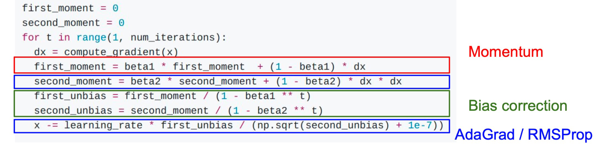
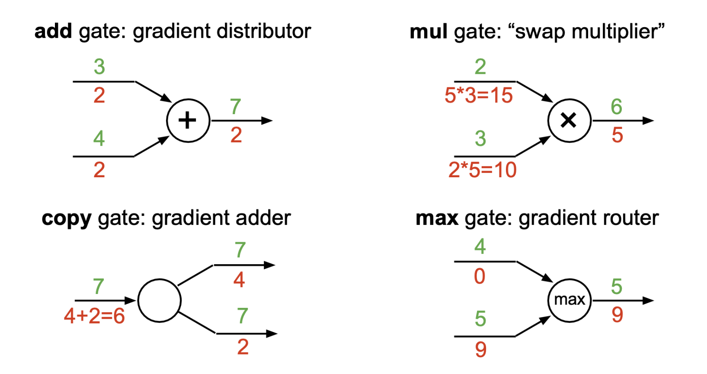

# 第一章
## 介绍
1. 图像分类：计算机视觉中的核心任务。给定一组可能的标签$(A,B,C,...)$，判断一个图片属于什么标签。
2. 图像分类可能遇到的问题：
    1. 语义鸿沟：计算机只能看到二进制数字
    2. 视角变化：每个不同角度拍摄的结果，tensor内容不同。
    3. 光照变化、背景干扰、遮挡（Occlusion）、类内变化（Intraclassvariation）、上下文（Context）
3. 数据驱动方法：
    1. 收集图像和标签的数据集
    2. 使用机器学习算法来训练分类器
    3. 在新图像上评估分类器
## 最近邻分类器
`train(image,labels) - return model`用于记住所有的数据和标签；`predict(model, test_images) - return test_labels`预测最相似的训练图像标签。
1. 最近邻方法：计算测试图像与所有训练图像的*距离*，取距离最近的训练图像的标签作为测试标签。
    1. L1距离：逐个像素计算差值绝对值。$$d_1(I_1,I_2) = \sum^p(|I_1^p - I_2^p|)$$。
    2. L2距离：逐个像素计算欧式距离。$$d_2(I_1,I_2) = \sqrt{\sum^p{(|I_1^p - I_2^p|)^2}}$$
    3. 对于最近邻方法，训练train存储训练集$X_t,y_t$；测试时计算全部输入测试$X$与训练$X_t$的绝对值差，并求最大。*训练O(1)，测试O(N)，测试速度太慢*。
2. K近邻：不从最近的邻居那里复制标签，而是从K个最近的点中获得多数投票。不适用像素距离。
3. *超参数*：k的最佳值是多少？最佳使用距离是多少？超参数设置非常依赖于问题/数据集。
    1. 如何设置超参数？**设置验证集(Validation)**，将训练集train data分成train + val集，在val上调整超参数，在test集上进行评估(evaluate)。
    2. Cross Validation：k折交叉验证。将训练集分为k份，进行k次训练，依次选取第1,2,3...k个子集作为validation，其余作为train
## 线性分类器
使用一个函数$f(W,x) = Wx + b$来进行分类。$W$是权重，输出$m$类样本概率。
1. 对于一个被拉伸到长度为$(x,1)$的图像，类别有$m$个，$W$的维度是$(m,x)$，$b$的维度是$m$，计算$f(W,x) = Wx + b$得到该图像对于$m$个类别的得分。

2. *不能解决非线性情况*：
3. **损失函数**：衡量模型结果的满意程度。$$L = \frac{1}{N}\sum_i{(L_i(f(x_i,W),y_i))}$$
    1. 多分类SVM损失：$$L_i = \sum_{j \neq y_i}(max(0, s_j - s_{y_i} + 1))$$。对于每一张图的所有$m-1$个错误类别，用正确类别分数-错误类别分数，得到的值+1，若>0则加入损失，否则不加入。本质上是要让正确类别输出分数最大。注意最终要求平均。
    
    > Q1：在这个训练例子中，如果汽车分数下降0.5，损失会发生什么？A1:*不变*
    > Q2：支持向量机损失Li的最小/最大可能值是多少？A2：*最小值0，最大值无限大*
    > Q3：初始化时W很小，所以所有s≈0。假设N个例子和C个类，损失Li是多少？A3：*$N\times(C-1)$*
    > Q4：如果求所有类别的和呢？（包括j=y_i）。A4：*相当于增加一个常数项1，$L_i' = L_i + 1$*
    > Q5：如果用均值而不是和呢：A5：更不易梯度爆炸。
    > Q6：如果我们使用$$_i = \sum_{j \neq y_i}(max(0, s_j - s_{y_i} + 1)^2)$?A6：损失函数从：变为：
    > Q7：假设能找到一个$W$满足了$L = 0$，这个$W$是唯一的吗？A7：*不是唯一的，因为至少2W,3W...也满足*
4. Softmax分类器:将原始分类器分数解释为概率。$$P(Y = k|X = x_i) = \frac{e^{s_k}}{\sum_j{e^{s_j}}}$$其中$s_j$表示第$j$类得分。
    1. *最大似然估计*：选择权重以*最大化观测数据的可能性*
    2. 单个样本损失$$L_i = -\log{P(Y = y_i|X = x_i)} = -\log{\frac{e^{s_k}}{\sum_j{e^{s_j}}}}$$
    3. 增加KL散度：$$D_{KL} = \sum_i{p_i\log{\frac{p_i}{q_i}}}$$ $P,Q$指模型预测概率、实际真实概率1。对于交叉熵损失$H(P,Q) = -\sum_i{p_i\log{q_i}}$，就是$$H(p,q) = H(p) + D_{KL}(p||q)$$，其中$H(P) = -\sum_i{p_i\log{p_i}}$是指熵
    > Q1：最小/最大可能的softmax损失Li是多少？A1：*最大为0，最小为负无穷*
    > Q2：在初始化时，所有sj将近似相等；假设C类，softmax损失Li是多少？A2：*$\log(C)$*
## 第一章重点
计算SVM和Softmax损失：SVM:$$L_i = \sum_{j \neq y_i}(max(0, s_j - s_{y_i} + 1))$$ Softmax：$$L_i = -\log{P(Y = y_i|X = x_i)} = -\log{\frac{e^{s_k}}{\sum_j{e^{s_j}}}}$$
# 第二章 
## 正则化
防止模型在训练数据上做得太好，偏好更简单的模型、对权重增加偏好、增加曲率来改善优化过程。
$$L(W) = \frac{1}{N}\sum_i{(L_i(f(x_i,W),y_i))} + \lambda R(W)$$。增加一个权重损失项(奥卡姆剃刀)。增加一个超参数$\lambda$
1. L1,L2正则化的权重损失：
    1. L1是权重绝对值和；L2是权重平方和(偏好分散的权重)；L1L2联合是增加$\beta$参数
    2. 
2. 其他正则化方法：Dropout、BatchNorm、Stochastic Depth(随机深度网络)
## 优化
### 梯度：
1. 梯度是沿着每个维度的偏导数组成的向量。*下降最陡的方向是负梯度*。
2. 梯度计算：
    1. 数值梯度：需要遍历所有维度（所有权重），是*近似计算*。对一个权重+0.001，再计算Loss，得到的新值来计算梯度：$\frac{df(x)}{d(x)} = \frac{f(x+\Delta) - f(x)}{\Delta}$
    2. 解析梯度：将Loss看成w的函数，使用微积分计算解析梯度。
3. 梯度检查（gradient check）：计算出解析梯度后，*使用数值梯度进行验证*。
4. 梯度下降：$w' = w - \text{step-size} \times \text{gradient}$
    1. 随机梯度下降：使用小批量样本（32、64个等）来近似全局Loss，对于每一批次样本都进行梯度下降。
    2. 如果损失在一个方向上变化很快，在另一个方向变化很慢怎么办？梯度下降会变成什么样？*A:沿浅维度进展非常缓慢，沿陡峭方向抖动*
    3. **损失函数具有较高的条件数**：Hessian矩阵的最大奇异值与最小奇异值之比较大
##### SGD问题：
1. *鞍点*：一个不是局部极值点的驻点称为鞍点。遇到鞍点时，梯度为0，梯度下降被卡住
2. *SGD的梯度来自于mini_batch*，可能存在噪声
3. 解决方法：
    1. 增加动量momentum：$v_{t+1} = \rho v_t + \Delta f(x)$，进行梯度下降：$w_{t+1} = w_t - \alpha v_{t+1}$。$v$指速度，$\rho$指摩擦。
    2. 使用AdaGrad：采用自适应学习率。基于历史梯度平方和来缩放学习率。
    > Q1:梯度怎么走？A1:沿着“陡峭”方向的进展受到抑制；沿着“平坦”方向的进展加快
    > Q2:随着时间累计，步长会怎样变化？A2:衰退为0
    3. 使用RMSProp，增加decay rate
    3. 使用AdaMomentum。
    > Q1:第一个时间步发生什么？A：*第一个时间步 没有历史信息可用，所以这时候的动量和平方项都比较“偏小”。这种偏小的估计在前几步会严重低估真实的一阶和二阶矩*
    4. 对AdaMomentum的第一和第二矩估计从零开始的事实进行偏差校正
    5. AdamW：有权重衰减的Adam变体
##### 学习率计划
1. 学习率衰减：在第30、60、90等轮次时降低一次学习率，或按照某个函数下降

2. 线性Warmup
    1. 在前k次迭代中，学习率从0缓慢增加到n；
    2. 经验而言，若batchsize增大N，学习率也增大N
##### 其他问题
1. Q1：为什么牛顿法（二阶Hessian矩阵逼近梯度）不适用于深度学习？
A1:Hessian有$O(N^2)$个元素,求逆需要$O(N^3)$，N = 数千万或数亿，过大
2. 实际应用中多默认用Adam
## 神经网络和反向传播
全连接网络：$f = W_2(max(0,w_1x))$，其中的$max(0,f)$是激活函数。
层数越多，非线性分类能力越强；不要使用神经网络的大小作为正则化因子，要选用更强的正则化。
### 激活函数
若不加激活函数，则多次全连接结果仍然是一个线性分类器。
1. 激活函数类型：
2. Sigmoid：缩放到0-1；存在问题：   
    1. 梯度消失，饱和的神经元会导致梯度接近0，导致权重不再训练。
    2. 不是中心对称
    3. 梯度局部都是正数，所有wi的梯度与上游梯度的符号相同，总是全部为0或全部为1.
    4. 计算exp成本较高
3. tanh：缩放-1 到 1，以0为中心，饱和神经元仍然会导致梯度消失
4. Relu：
    1. 不饱和，计算效率高，收敛速度快。
    2. 输出不是0中心。输入<0时，梯度变为0，存在“死神经元”问题
5. LeakyRelu：不存在死神经元
6. ELU：继承relu所有特性，且平均输出接近0，有负饱和状态，对噪声更鲁棒。
    1. SELU:在ELU的正负两端都加一个缩放因子$\lambda$，可以做到自规范性，适用于更深的网络，可以不用BatchNorm
7. 
8. 
### 反向传播
需要确定神经网络的损失函数，例如SVM损失/Softmax的交叉熵损失。之后通过梯度链式法则进行计算：从头开始推导，对于非常复杂的模型不可行！
##### 更好的想法: 计算图+反向传播

1. 不同门的图梯度传播：
2. 向量函数导数：
    1. 
    2. 向量导数反向传播：标量Loss对向量*z*求导，就是Loss对*z*每个标量值z1,z2...单独求导，得到一个导数向量；向量*z*对向量*x*求导，就是*z*的每个值z1,z2,...看做*x*的函数，得到雅可比矩阵$ \begin{pmatrix} f_1(x) \\f_2(x) \\f_3(x) \\ ... \end{pmatrix}$。对这个雅可比矩阵的每一项，求出对于*x*每个项x1,x2,...的导数$$ \begin{pmatrix} \frac{\partial f_1(x_1)}{\partial x_1} & \frac{\partial f_1(x_2)}{\partial x_2} & \frac{\partial f_1(x_3)}{\partial x_3} ...\\ \frac{\partial f_2(x_1)}{\partial x_1} & \frac{\partial f_2(x_2)}{\partial x_2} & \frac{\partial f_2(x_3)}{\partial x_3} ... \\ \frac{\partial f_3(x_1)}{\partial x_1} & \frac{\partial f_3(x_2)}{\partial x_2} & \frac{\partial f_3(x_3)}{\partial x_3} ... \\ ... \end{pmatrix} $$
    
    
    
    3. 矩阵对矩阵求导：
    由这些公式可以看到，对于神经网络中的一层，有：$$y = w^T x$$，若已知损失函数$L$对$y$的偏导数$\frac{\partial L}{\partial y}$，则可以计算得到：$$\frac{\partial L}{\partial x} = (\frac{\partial L}{\partial y}) \times w^T$$$$\frac{\partial L}{\partial w} = x^T \times (\frac{\partial L}{\partial y})$$
# 第三章 卷积神经网络
1. 图像特征：从图像中提取到的特征。例如$f=wx$、颜色直方图、方向梯度直方图、词袋（将图像随机提取多块，对图像进行聚类，形成“视觉单词”的码本）等
2. 卷积网络：全连接网络破坏了网络的空间结构，而卷积网络可以保留空间结构。
    1. 具体计算方式：对于一个$k \times k \times c$大小的卷积核，从图像(n \times n \times c)的第0行第0列开始，将卷积核区域中的值$x_{i,j,c}$×卷积核权重对应位置值$w_{i',j',c}$，全部相加得到第0行第0列卷积图像值，接下来向右滑动继续卷积，最终得到一个卷积图像。对于$c$个通道都进行这样的操作，可以得到$c$张卷积图像，对应位置每个像素求和，就得到了卷积核对应的最终卷积图像（若有bias偏置，那么在每个卷积核中都有一个bias，每次卷积的结果都会+bias），大小为$$n' = \frac{(n - k + 2\text{padding})}{\text{stride(步长)}} + 1$$。若一个卷积层有$c'$个卷积核，能够得到$c'$张完整的卷积图像，那么最终进过卷积层，图像维度变为$n' \times n' \times c'$。
    
    2. 卷积网络是加了激活函数的卷积层序列。输入→卷积层→激活→卷积层→激活→...
    3. 卷积网络学到什么？第一层卷积：局部图像模板（经常学习方向边缘、相反的颜色）
    4. 计算卷积层参数量：$a\times b \times c$的卷积核，有$abc+1$(有bias)个参数。若有$k$个卷积核，就是$k(abc+1)$
3. 感受野
    1. 对于一个$k\times k$的卷积核，经过卷积后，下一层像素感受野为$k-1$。若连续使用这种尺寸的卷积核到$L$层，则$L$层感受野为$1 + L(k-1)$
    2. 对于大尺寸提箱，为了能让输出看到图像全貌，需要设置很多层，解决方法：下采样(Downsample)
4. 池化层：
    1. 使得特征表示的尺度更小、更容易管理
    2. MaxPooling：没有可学习参数，引入空间不变性。maxpooling核操作类似卷积核，但是取整个区域最大值输出，而不是加权求和。需要F尺寸、S步长。
5. 全连接层FC Layer
## 卷积网络架构
##### 卷积网络组件
1. 批归一化(Batch Norm)：
    1. 将*输入*的均值置为0，方差为1.使用下列公式$$x' = \frac{x - E(x)}{\sqrt{\text{Var}(x)}}$$对于一个$N\times D$的输入，有：$i$表示第$j$个channel的第$i$个输入
    2. 然而，均值0、方差1过于严格，所以引入**可学习尺度$\gamma$和偏移$\beta$**。输出时，使用$y_{i,j} = \gamma_j \hat{x_{i,j}} + \beta_j $。
    3. 使用可学习参数后，训练时的$\mu_j,\sigma_j$可计算，但测试时minibatch=1，无法计算，解决方法：每次训练记录均值方差，测试时使用见过的均值方差的均值进行计算，但$x_{i,j}$计算时，要在方差上加随机扰动。
    4. BN层**插在卷积/FC层之后，激活层之前**。对于FC层，计算均值方差是根据不同样本来算的，即$N \times D$(一个batch中$N$个样本有$D$维数据)计算出$1 \times D$的均值方差，$\gamma,\beta$尺寸$1 \times D$；对于卷积层而言，只对每个样本每个通道的像素做均值方差，而每个通道不同，即$N \times C \times H \times W$(一个batch中$N$个样本，每个样本$C$通道，长宽为$H,W$)，计算均值方差为$N \times C \times 1 \times 1$(BatchNorm2d)，计算得到的$\gamma,\beta$尺寸$1 \times C \times 1 \times 1$(BatchNorm2d)$
    5. 好处：
##### 经典架构
1. AlexNet：使用了LRN
2. VGGNet：更小的滤波器，更深的网络。使用更小滤波器原因：三个3x3 conv（步长1）层的堆叠与一个7x7 conv层具有相同的有效感受野相同，但参数量少得多，且层数更深，引入更多非线性。占用内存较多，主要是全连接层
3. GoogleNet：有高效的“Inception”模块(对上一层输入进行并行卷积+maxPooling，有1,3,5大小的卷积核，最后拼接)，没有FC层，而是在最后进行全局平均池化为$1\times 1 \times c$；层数更深但参数量更低。
    
    1. 解决方法：bottleneck。使用$1×1$卷积，但更少的通道数，即将$n\times n \times c$ 转换为$n\times n \times c'$，将深度投影到较低维度。保留了空间维度，并且减少深度。
4. ResNet：普通卷积网络，更深的模型表现更差，但这并不是由过拟合引起的，更深层的模型更难优化
    1. 尝试拟合残差映射，而不是直接尝试拟合所需的潜在的映射
    
    2. 浅层网络：使用BasicBlock结构来进行残差连接
    3. 深层网络：使用BottleNeck结构来进行残差连接
5. SENet：改进残差连接，增加特征校准模块，自适应调整特征图权重
6. 残差连接改进：
    1. 
    2. 
    3. 增加Dense Net
7. Mobile Net
8. NAS:学习搜索网络结构
##### 架构总结
1. Alexnet说明可以使用卷积神经网络来训练计算机视觉模型
2. ZFNet，VGG表明越大的网络工作得越好
3. GoogLeNet是首批使用1x1瓶颈卷积和全局平均池而不是FC层来关注效率的公司之一
4. ResNet向我们展示了如何训练极其深入的网络，ResNet之后：卷积神经网络优于人类指标，重点转向高效网络：
6. 许多针对移动设备的小型网络：MobileNet、ShuffleNet、现在可以自动化架构设计神经架构搜索（NAS）
## 迁移学习

在大型数据集上训练后，迁移模型到小数据集上，固定多数模块，训练小模块
# 第四章 神经网络训练
## 激活函数
放在第二章了
## 数据预处理
若输入数据全是正，则梯度全正/全负。所以需要零均值的输入。
1. 使用均值方差归一化/PCA/Whiting，可以得到较好的数据。

2. 归一化前：分类损失对权重矩阵的变化非常敏感；难以优化；归一化后：对权重的微小变化不太敏感；更易于优化
